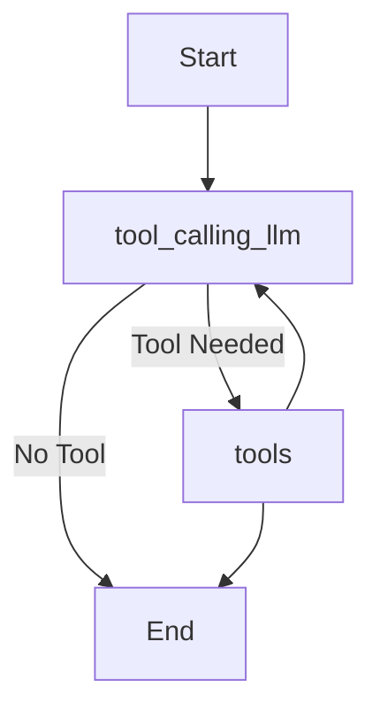

# Agentic-ai-chatbot-using-LangGraph


````markdown
# 🧠 Agentic AI Chatbot with LangGraph + Groq + Multi-Tools

This project is a modular **Agentic AI chatbot system** built using **LangGraph**, **Groq's ultra-fast LLMs**, and a suite of integrated tools like **Arxiv**, **Wikipedia**, and **Tavily Search**. It showcases how AI agents can dynamically decide when to use external tools to fetch information in a reasoning loop.

---

## 🚀 Project Demo

> The chatbot can answer general questions, search recent AI news, query scholarly articles, and explain concepts using structured agent loops.

---

## 🛠 Tech Stack

| Component        | Description |
|------------------|-------------|
| 🧩 LangGraph     | Framework for building agentic workflows as graphs |
| ⚡ Groq LLM       | Extremely fast large language models (`qwen-qwq-32b`) |
| 🛠 LangChain Tools | Prebuilt tools from `langchain_community` |
| 🔍 Tavily Search  | Real-time web search API |
| 📚 Arxiv API      | Academic paper querying tool |
| 📖 Wikipedia API  | General knowledge fetcher |
| 🐍 Python         | Programming language |
| 🔐 dotenv         | Environment variable management |

---

## 🧠 Agentic AI Architecture

This project uses **LangGraph** to create an *agent loop* that decides whether a tool is needed, fetches results using the appropriate tool, and continues reasoning.

### Nodes & Logic:

- **tool_calling_llm**: Uses Groq's LLM with bound tools. If a tool call is generated, the graph branches accordingly.
- **tools**: Executes the actual tool call (Arxiv, Wikipedia, or Tavily).
- **Edges**:
  - If LLM output requires a tool → forward to `tools`
  - After tool execution → return to `tool_calling_llm` to continue reasoning
  - If no tool needed → go to `END`

> This loop creates a dynamic agent that mimics thought–action–observation cycles, similar to frameworks like ReAct or AutoGPT.

---

## 🔧 Tools Used

1. **Arxiv Tool**
   - Queries academic papers using `ArxivQueryRun`
2. **Wikipedia Tool**
   - Fetches general info from Wikipedia using `WikipediaQueryRun`
3. **Tavily Search Tool**
   - Retrieves current information via web search

---

## 🧪 Sample Use Cases

```python
messages = graph.invoke({"messages":"What is the recent AI news and then please tell me the recent research paper on blockchain"})
````

This triggers the AI to:

1. Use Tavily to fetch recent AI news
2. Use Arxiv to search for blockchain research papers
3. Return synthesized results

---


## 🧩 How It Works (Execution Flow)




---

## 📦 Setup Instructions

1. Clone the repo

```bash
git clone https://github.com/your-username/Agentic-ai-chatbot-using-LangGraph.git
cd Agentic-ai-chatbot-using-LangGraph
```

2. Create `.env` and add:

```env
TAVILY_API_KEY=your_api_key
GROQ_API_KEY=your_api_key
```

3. Install dependencies

```bash
pip install -r requirements.txt
```

4. Run the ipynb file


---

## 📌 Key Highlights

* 🌐 Real-time AI agent with reasoning + tool use
* 🏗 Powered by LangGraph’s graph-based state management
* 🚀 Lightning-fast responses using Groq’s `qwen-qwq-32b`
* 🧠 Can fetch, synthesize, and reason over multi-source information

---

## 📄 License

MIT License. See `LICENSE` file.

---

## 💬 Acknowledgments

* [LangChain](https://github.com/langchain-ai/langchain)
* [Groq](https://groq.com/)
* [LangGraph](https://github.com/langchain-ai/langgraph)
* [Tavily API](https://www.tavily.com/)
* [Arxiv API](https://arxiv.org/help/api/)
* [Wikipedia API](https://pypi.org/project/wikipedia/)

---

> ✨ Feel free to fork or contribute to expand agent capabilities!

```

