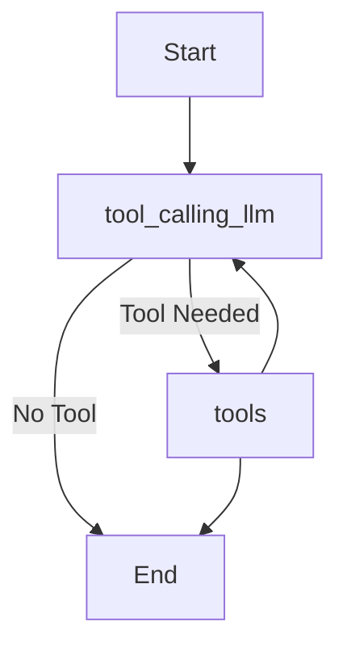

# 🧠 LangGraph AI Assistant  - Askie

A powerful AI assistant built using **LangGraph** and **Groq LLM**, capable of answering user queries and intelligently invoking multiple tools like Wikipedia, Arxiv, PDF retrieval, web search, joke generation, and CSV data analytics. This assistant logs tool usage, performs in-depth analysis of usage data, and provides both a chatbot and analytics interface through **Streamlit**.

---

## 📌 Table of Contents

* [🚀 Introduction](#-introduction)
* [🎯 Scope](#-scope)
* [🧰 Tech Stack](#-tech-stack)
* [📁 Project Structure](#-project-structure)
* [✨ Features](#-features)
* [⚙️ How It Works](#-how-it-works)
* [🛠️ Tools Used](#-tools-used)
* [📊 Tool Usage Analytics](#-tool-usage-analytics)
* [💡 Future Enhancements](#-future-enhancements)
* [🧪 Setup & Usage](#-setup--usage)

---

## 🚀 Introduction

LangGraph AI Assistant is a conversational AI application designed to demonstrate the powerful capabilities of the LangGraph workflow engine, integrated with **Groq's Qwen-QWQ-32B LLM**. It supports natural language interaction and smart tool invocation with dynamic analytics and data visualizations.

---

## 🎯 Scope

This project showcases:

* Integration of **LangGraph** for stateful tool-based conversation management.
* Use of **Streamlit** to provide an interactive and user-friendly UI.
* Real-time **tool usage tracking** and visualization.
* Dynamic CSV **data analysis** via an LLM-enabled tool.
* Seamless use of external resources (e.g., Wikipedia, Arxiv, Tavily search) to enhance query responses.

---

## 🧰 Tech Stack

| Component         | Technology                                             |
| ----------------- | ------------------------------------------------------ |
| 🧠 LLM            | [Groq Qwen-QWQ-32B](https://groq.com/)                 |
| 🔧 Framework      | [LangGraph](https://github.com/langchain-ai/langgraph) |
| 💬 Language Agent | [LangChain](https://www.langchain.com/)                |
| 🌐 UI             | [Streamlit](https://streamlit.io/)                     |
| 📊 Data Handling  | Pandas, CSV, FAISS, HuggingFace                        |
| 📚 External APIs  | Wikipedia, Arxiv, Tavily, JokeAPI                      |

---

## 📁 Project Structure

```
├── main.py                 # LangGraph workflow & LLM logic
├── ui.py                   # Streamlit UI
├── tool.py                 # Tool definitions and utilities
├── tool_usage_log.csv      # CSV log for tool usage
├── dbms.pdf                # Source file for PDF QA
├── faiss_dbms_index/       # FAISS vector store (auto-generated)
├── .env                    # API keys
├── requirements.txt
└── README.md
```

---

## ✨ Features

* 💬 **Chatbot Interface** – Natural conversation with automatic tool invocation.
* 🔧 **Dynamic Tool Triggering** – Tools like Wikipedia, Arxiv, and Tavily Search are triggered based on intent.
* 📄 **PDF Q\&A** – Ask domain-specific questions about the uploaded DBMS textbook.
* 🤣 **Joke Generator** – Fetches a programming joke from JokeAPI.
* 📊 **Usage Analytics** – Tracks tool usage over time and visualizes it with bar charts.
* 🧠 **CSV Data Analysis Tool** – Analyzes usage logs for statistical insights using Groq LLM.
* ⏱ **Response Time Logging** – Tracks how long tools take to execute.

---


🤖 What is LangGraph?
LangGraph is a stateful, graph-based orchestration framework designed specifically for large language model (LLM) applications. It enables you to construct modular, reactive workflows using simple nodes (functions) and conditional flows between them.

It extends the LangChain ecosystem, allowing you to build complex LLM agents with tool-use behavior, memory, retries, fallbacks, and more—structured like a flowchart.

## ⚙️ How It Works

## 🧩 (Execution Flow)


| Node                   | Functionality                                                                                  |
| ---------------------- | ---------------------------------------------------------------------------------------------- |
| **Start**              | Entry point to the workflow.                                                                   |
| **tool\_calling\_llm** | The LLM node (Groq Qwen-QWQ-32B) generates a response and determines whether a tool is needed. |
| **tools**              | Invokes the appropriate tool (e.g., joke, PDF, Wikipedia, CSV analysis).                       |
| **End**                | Terminates the workflow when no tool is needed or after tool output is processed.              |


1. **User submits a query.**
2. The **LangGraph** workflow:

   * Adds user input to the state.
   * Passes it to the Groq-powered LLM.
   * If tools are needed, it invokes them via `ToolNode`.
3. Tool usage is logged to `tool_usage_log.csv`.
4. Results are returned and displayed in the UI.
5. On the analytics tab, CSV data is visualized and analyzed.

---

## 🛠️ Tools Used

### 1. 📚 **Wikipedia Tool**

Fetches concise information using the Wikipedia API.

### 2. 📖 **Arxiv Tool**

Searches academic papers from Arxiv related to the user query.

### 3. 🌍 **Tavily Web Search**

Retrieves current web results for real-time information.

### 4. 🤣 **Programming Joke Tool**

Uses JokeAPI to deliver a random programming-related joke.

### 5. 📘 **PDF Question Answering Tool**

* Reads a domain-specific textbook (`dbms.pdf`).
* Creates or loads FAISS vector index.
* Answers questions using RetrievalQA with Groq LLM.

### 6. 📈 **CSV Analysis Tool**

* Reads `tool_usage_log.csv`.
* Computes:

  * Total tool calls
  * Most/least used tools
  * Average, min, max, and std deviation of response time
* Displays an ASCII bar chart of tool usage.

---

## 📊 Tool Usage Analytics

> Automatically logs and analyzes tool invocations.

Logged fields:

* Timestamp
* Tool Name
* Query
* Response Time (sec)

Visualization:

* Bar chart of tool usage frequency
* Raw data table
* Detailed LLM-based statistical summary (via analyze\_tool\_usage\_csv tool)

---


### 📘 **OUTPUT**


## 💡 Future Enhancements

* Upload and analyze any PDF.
* User authentication & session storage.
* Real-time web search fallback if tools fail.
* Scheduled analytics report via email.
* Admin dashboard for tool monitoring.

---

## 🧪 Setup & Usage

### 🔧 Prerequisites

* Python 3.9+
* Create a `.env` file:

```env
TAVILY_API_KEY=your_tavily_api_key
GROQ_API_KEY=your_groq_api_key
```

### 📦 Install Dependencies

```bash
pip install -r requirements.txt
```

### 🚀 Run the App

```bash
streamlit run ui.py
```

---

## 📝 License

This project is licensed under the MIT License.


